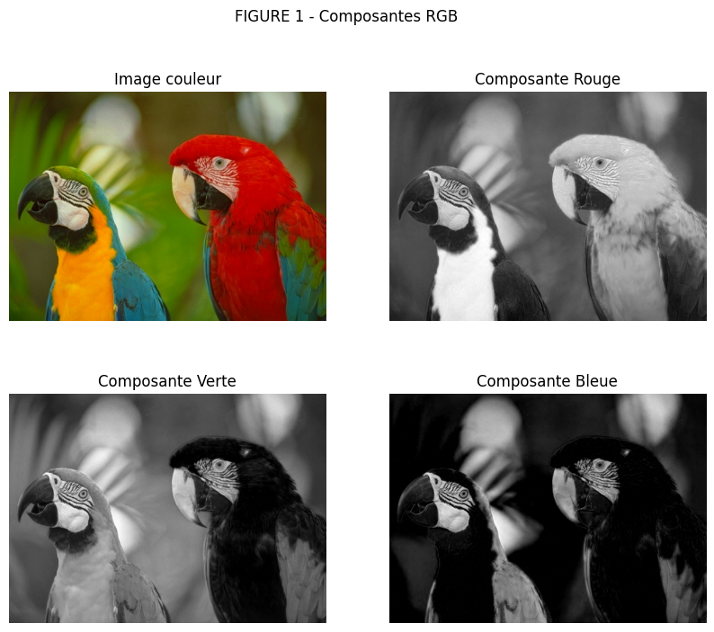
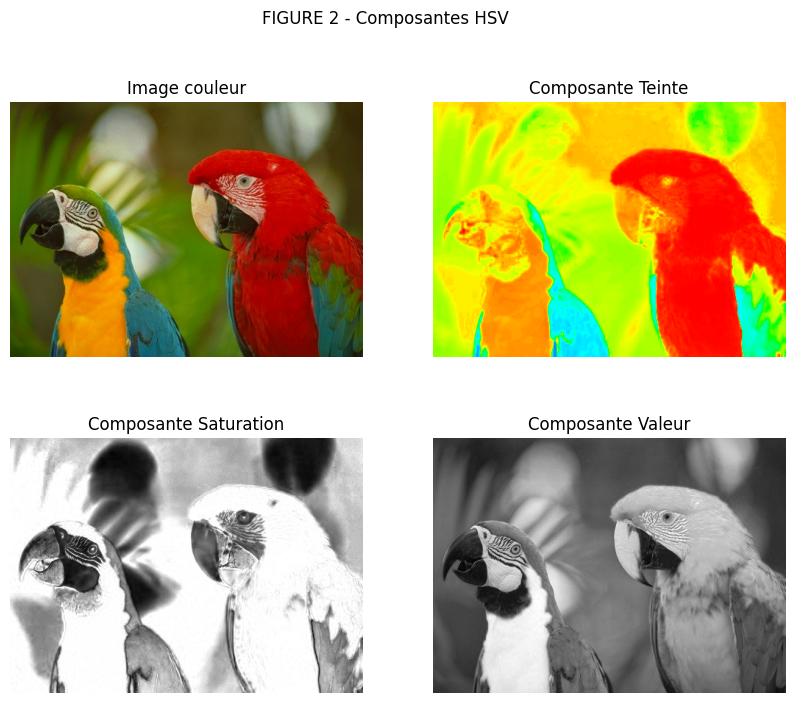
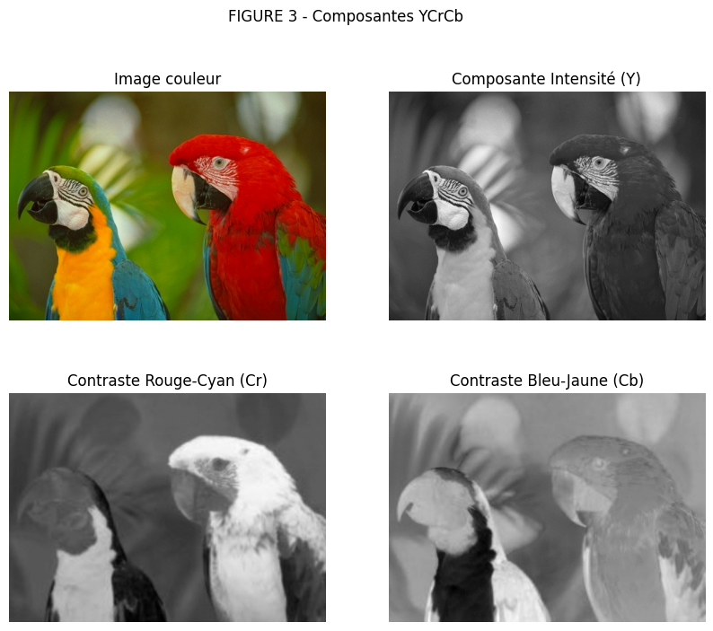
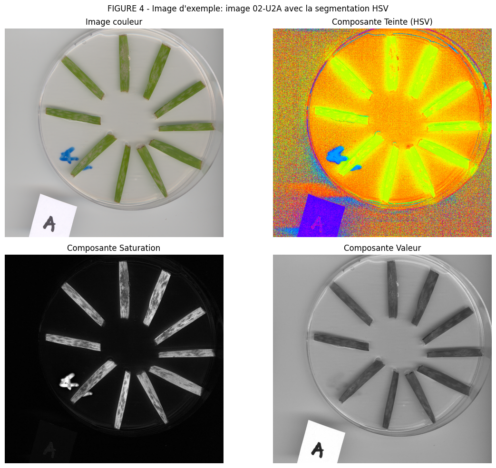
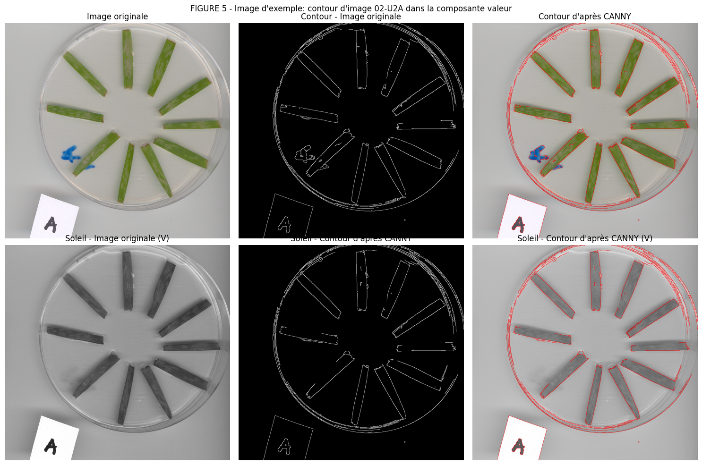
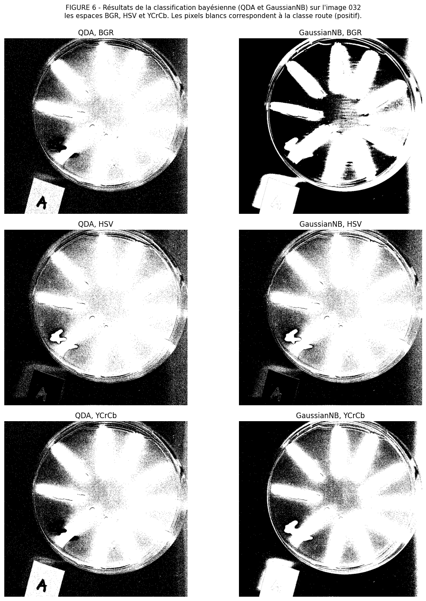
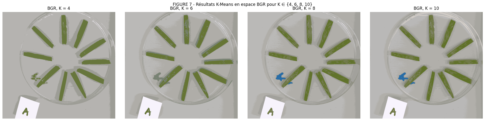
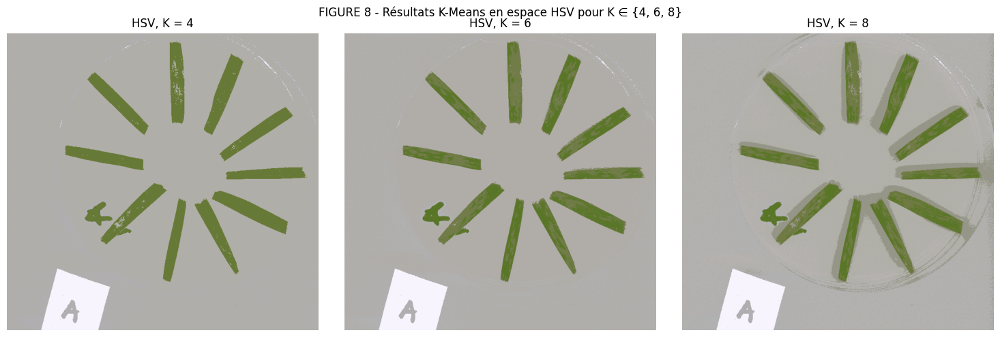
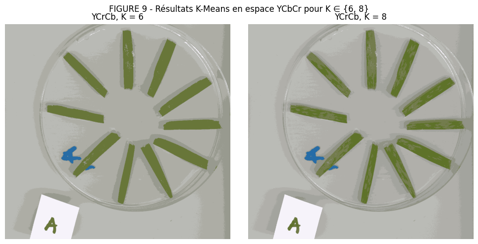

# Rapport TP2 : Classification de Caractéristiques Locales et Segmentation d'Images

## 1. Introduction

La classification de caractéristiques locales en images constitue une étape fondamentale dans diverses applications de vision par ordinateur, allant de la segmentation et de la reconnaissance de motifs à l'analyse de scènes complexes. Ce domaine d'étude repose sur deux approches principales : l'approche supervisée, qui utilise des données préalablement étiquetées pour construire un modèle prédictif, et l'approche non supervisée, qui organise les données en fonction de similitudes intrinsèques, sans nécessiter d'étiquettes préalables.

Dans le contexte de ce travail pratique, l'accent porte sur l'application de ces approches à la segmentation d'images, spécifiquement par la classification de pixels. Deux méthodologies paradigmatiques sont explorées : la classification bayésienne, qui utilise des principes probabilistes pour déduire la classe d'un pixel en fonction de ses caractéristiques observées, et l'algorithme K-Means, une technique de regroupement non supervisé qui partitionne les données en un nombre prédéfini de clusters.

L'objectif de ce rapport est de décrire l'implémentation, l'analyse critique et les résultats obtenus dans la résolution d'un problème concret de segmentation. Contrairement à l'exemple de scènes routières (Kitti), ce travail se concentre sur l'identification de pathologies chez les plantes en utilisant l'ensemble de données INRA. Cette tâche est cruciale pour les systèmes d'agriculture de précision et de diagnostic automatisé, où la délimitation correcte des zones affectées est essentielle pour surveiller la santé des cultures et prendre des décisions.

La structure du rapport suit le guide proposé, commençant par la préparation de l'environnement et l'exploration des données, suivie par l'application et la comparaison des méthodologies de classification bayésienne (supervisée) et K-Means (non supervisée). Il se termine par une discussion sur les défis rencontrés, les décisions prises et les conclusions sur l'efficacité de chaque méthode. Les résultats visuels et les analyses quantitatives seront présentés pour soutenir les observations et critiques formulées tout au long du travail.

## 2. Principes de la Classification Bayésienne

La classification bayésienne est une approche probabiliste fondée sur le théorème de Bayes. Son objectif primordial est d'attribuer à une observation $x$ la classe $C_k$ qui est la plus probable, compte tenu des données observées.

Le principe fondamental consiste à modéliser la probabilité a posteriori d'une classe étant donné une observation, notée $P(C_k|x)$, en utilisant la vraisemblance $P(x|C_k)$, la probabilité a priori $P(C_k)$ et la vraisemblance totale (ou preuve) $P(x)$, par la relation :

$$ P(C_k | x) = \frac{P(x | C_k) P(C_k)}{P(x)} $$

La règle de décision bayésienne consiste alors à choisir la classe qui maximise cette probabilité a posteriori (MAP - Maximum A Posteriori).

On peut distinguer deux approches principales pour l'estimation :
*   **Estimation par Maximum de Vraisemblance (ML - Maximum Likelihood) :** On suppose que les classes sont équiprobables et on maximise uniquement $P(x|C_k)$. Cette approche est couramment utilisée dans des classificateurs comme Naive Bayes lorsque les distributions des caractéristiques sont estimées à partir des données sans tenir compte de la fréquence des classes.
*   **Estimation par Maximum A Posteriori (MAP) :** On prend en compte les probabilités a priori des classes. Ceci est particulièrement utile lorsque certaines classes sont plus rares que d'autres (classes déséquilibrées).

Ainsi, la classification bayésienne constitue un cadre théorique cohérent pour la prise de décision en présence d'incertitude.

**Question 1 : Différence entre ML et MAP**

**Question :** Quelle différence y a-t-il entre la classification par le critère du maximum de vraisemblance (ML) et celui du maximum a posteriori (MAP) ? Comment cette différence se traduira-t-elle dans vos programmes ?

**Réponse :**
La différence fondamentale entre le critère de Maximum de Vraisemblance (ML) et celui de Maximum A Posteriori (MAP) réside dans la prise en compte ou non des probabilités a priori des classes.

*   **Maximum de Vraisemblance (ML) :** On sélectionne la classe $C_k$ qui maximise $P(x|C_k)$, c'est-à-dire la vraisemblance des observations étant donné la classe. Cette approche suppose implicitement que toutes les classes sont équiprobables ($P(C_k) = \frac{1}{K}$) ou ignore complètement leur distribution a priori.
*   **Maximum A Posteriori (MAP) :** On sélectionne la classe $C_k$ qui maximise $P(C_k|x)$, la probabilité a posteriori. Par le théorème de Bayes, cela équivaut à maximiser $P(x|C_k)P(C_k)$, puisque $P(x)$ est un facteur de normalisation constant pour toutes les classes. On intègre donc la connaissance éventuelle sur la fréquence d'apparition des classes.

Pour notre programme, la principale différence apparaît dans l'utilisation de `QuadraticDiscriminantAnalysis`. Lorsque nous définissons `priors=None`, nous utilisons les fréquences réelles des ROI sélectionnées ; les probabilités a priori sont donc estimées à partir des données et nous appliquons la règle **MAP**. Si nous définissions, par exemple, `priors=[0.5, 0.5]`, nous imposerions des classes équiprobables et appliquons ainsi le critère de **Maximum de Vraisemblance (ML)**.

### Sous-thème : Application à la classification bayésienne des pixels

La segmentation d'images basée sur la couleur consiste à utiliser les valeurs de chaque pixel pour séparer les régions d'intérêt. Pour ce faire, nous pouvons représenter la couleur des pixels dans différents espaces, chacun ayant ses avantages et ses limites.

1.  **RGB :** Représente directement les canaux Red (Rouge), Green (Vert) et Blue (Bleu) capturés par le capteur de la caméra.
    *   *Avantage :* Utile lorsque la couleur pure des objets est suffisante pour les distinguer.

2.  **HSV :** Divise la couleur en Hue (Teinte), Saturation et Value (Valeur/Intensité).
    *   *Avantage :* Le canal Hue décrit la couleur "pure" indépendamment de la luminosité ; le canal Value indique l'intensité de la lumière.

3.  **YCbCr :** Sépare l'image en Y (luminance) et Cb/Cr (canaux de chrominance).
    *   *Avantage :* Utile pour séparer la luminosité de la couleur ; permet de travailler avec des couleurs cohérentes même en présence de variations d'illumination.

### Question 2 : Limites de l'utilisation de la couleur seule

**Question :** Quelles sont les limites de l'utilisation des seules couleurs comme espace d'observation (caractéristiques) ? Quelles autres caractéristiques pouvez-vous proposer pour la segmentation d'images ?

**Réponse :**
Chaque modèle de segmentation présente des limites, qui peuvent être résumées comme suit :

*   **RGB :** Très sensible à l'illumination. Ne sépare pas efficacement les objets de couleurs similaires. Mélange l'information de couleur et d'intensité.
*   **HSV :** Plus robuste à l'illumination, mais les régions à faible saturation peuvent générer des ambiguïtés. Ignore la forme et la texture.
*   **YCbCr :** Peut ne pas distinguer les couleurs proches. Ne capture pas la texture ni les contours.

Sur la base de cela, on peut proposer certaines améliorations et caractéristiques utiles pour la segmentation. On peut utiliser l'opérateur de Sobel et la magnitude du gradient pour détecter les changements spatiaux (contours et bordures). Ajouter l'information spatiale (par exemple, une caractéristique `[R, G, B, x, y]`) permet d'éviter que des pixels distants, mais de même couleur, soient regroupés incorrectement.

L'utilisation combinée de plusieurs méthodes de segmentation permet une amélioration considérable. On peut souligner l'utilisation de YCbCr ou HSV pour traiter les problèmes liés à la luminance, et l'utilisation de RGB associée à l'information spatiale pour mieux gérer la couleur.

### 3. Classification de Caractéristiques Locales (Ensemble de Données INRA)

Dans ce travail pratique, nous nous intéressons à la segmentation d'images par classification de caractéristiques locales. Pour cela, nous utilisons l'**ensemble de données INRA**, qui contient des images de feuilles de blé dans des boîtes de Petri. L'objectif est d'isoler les pixels correspondant aux **champignons (maladie)**, afin de quantifier l'infection dans le contexte d'une application de diagnostic agricole automatisé.

La segmentation par caractéristiques locales consiste à représenter chaque pixel à l'aide de *caractéristiques* décrivant la couleur, la texture ou d'autres informations spatiales, puis à classer ces pixels en différentes classes (Champignon vs Non-Champignon). Cette approche permet de traiter des images complexes en exploitant les informations locales, plutôt que de simplement se fier à des seuils globaux uniques.

Les principaux problèmes pour cet ensemble de données sont :
*   **Variations de reflets sur la boîte de Petri** qui affectent significativement les couleurs observées.
*   **Objets distincts de couleurs similaires :** L'étiquette en papier blanc sur la boîte a des caractéristiques très similaires au champignon clair, créant une confusion.
*   **Manque de contexte spatial :** La classification pixel par pixel pure produit des résultats bruyants ("poivre et sel").

Pour atténuer ces problèmes, nous pouvons d'abord analyser certaines images en utilisant la segmentation dans des espaces de couleur comme HSV ou YCrCb, puis compléter cette analyse par un traitement des contours ou une morphologie mathématique pour tenir compte de la structure des objets et supprimer le bruit.

La Figure 4 illustre la segmentation d'une image de l'ensemble de données INRA en utilisant l'espace de couleur HSV. L'image originale est affichée avec la décomposition en composantes Hue, Saturation et Value. Cette visualisation permet d'identifier quelles caractéristiques de couleur sont les plus discriminantes pour séparer les différentes régions (feuille saine, champignon, arrière-plan).

La Figure 5 présente l'analyse des contours réalisée sur l'image originale et spécifiquement sur le canal Value (intensité) de l'espace HSV. Cette analyse est fondamentale pour délimiter les bordures entre les régions distinctes et réduire l'effet du bruit dans la classification pixel par pixel.

### Classification de Pixels : QDA et GaussianNB

Les deux classificateurs utilisés dans ce travail sont basés sur le cadre bayésien gaussien : chaque classe $C_k$ est modélisée par une distribution gaussienne multivariée, et la règle de décision consiste à attribuer à chaque pixel la classe qui maximise la probabilité a posteriori.

**Analyse Discriminante Quadratique (QDA)**
QDA est un classificateur bayésien gaussien multidimensionnel complet. Pour chaque classe $C_k$, il estime une moyenne $\mu_k$ et sa propre matrice de covariance $\Sigma_k$ :

$$ P(x | C_k) = \frac{1}{(2\pi)^{d/2} \sqrt{\det(\Sigma_k)}} \exp\left(-\frac{1}{2}(x - \mu_k)^T \Sigma_k^{-1} (x - \mu_k)\right) $$

La matrice $\Sigma_k$ capture les corrélations entre les différentes composantes de $x$ (dans ce cas, les canaux de couleur). La frontière de décision résultante entre deux classes est une quadrique (ellipse, parabole ou hyperbole), ce qui explique le nom du modèle. En utilisant le paramètre `priors=None`, les probabilités a priori $P(C_k)$ sont estimées à partir des fréquences observées dans les Régions d'Intérêt (ROI), ce qui équivaut à appliquer la règle MAP.

**Classificateur Bayésien Naïf Gaussien (GaussianNB)**
GaussianNB simplifie le modèle en supposant que les composantes de $x$ sont conditionnellement indépendantes étant donné la classe :

$$ P(x | C_k) = \prod_{j=1}^{d} \frac{1}{\sqrt{2\pi\sigma_{kj}^2}} \exp\left(-\frac{(x_j - \mu_{kj})^2}{2\sigma_{kj}^2}\right) $$

Dans ce modèle, chaque canal de couleur est modélisé séparément par une gaussienne univariée avec moyenne $\mu_{kj}$ et variance $\sigma_{kj}^2$. Cette hypothèse équivaut à supposer que la matrice de covariance $\Sigma_k$ est diagonale (zéros en dehors de la diagonale principale), ce qui réduit drastiquement le nombre de paramètres à estimer et accélère l'apprentissage. Le compromis est que, si les canaux de couleur sont corrélés (ce qui est fréquent dans le RGB), le modèle sera mal spécifié et la frontière de décision pourrait être sous-optimale.

**En résumé :** QDA est plus expressif et capable de modéliser des formes complexes de distribution de couleurs, mais nécessite plus de données pour estimer correctement la matrice de covariance complète. GaussianNB est plus robuste à la rareté des données et plus rapide, mais perd en précision lorsque l'hypothèse d'indépendance entre les canaux est violée.

## 3. Questions Théoriques et Analyse

### 3.1 Espaces d'Observation et Modèles

**Question :** Quels vous semblent être les espaces d'observations et le nombre de classes les mieux adaptés à la tâche qui vous intéresse ? Quelles sont les difficultés potentielles ? Quelles différences observez-vous entre le modèle bayésien gaussien multidimensionnel et le modèle bayésien gaussien naïf ?

**Réponse :**

**Espaces d'Observation et Classes :**
Pour la tâche de segmentation des champignons sur les feuilles (ensemble de données INRA), l'espace **YCrCb** semble être le mieux adapté. Le canal de luminance (Y) permet de séparer l'arrière-plan clair de la feuille sombre, tandis que les canaux de chrominance (Cr et Cb) sont efficaces pour distinguer le vert de la feuille saine des tons jaunâtres/blanchâtres du champignon. L'espace HSV serait également une bonne alternative (séparant la teinte et la saturation). Le RGB est moins recommandé en raison de la forte corrélation entre les canaux et de la sensibilité à l'illumination.

Quant au nombre de classes, l'idéal serait **3 classes** : (1) Arrière-plan/Boîte, (2) Feuille Saine, (3) Champignon/Maladie. Utiliser seulement deux classes (Arrière-plan vs Objet) mélangerait la feuille et le champignon, tandis que (Maladie vs Non-Maladie) pourrait confondre l'arrière-plan clair avec le champignon clair. Définir 3 classes permet de modéliser explicitement la couleur de chaque composante de la scène.

**Difficultés Potentielles :**
*   **Chevauchement de Couleurs :** L'étiquette en papier blanc sur l'image a des caractéristiques de couleur très similaires au champignon, générant des faux positifs.
*   **Reflets Spéculaires :** Les bordures de la boîte de Petri et les gouttes de liquide créent des reflets brillants (saturation du blanc) qui ne suivent pas la distribution gaussienne "normale" des couleurs de la feuille ou de l'arrière-plan, étant fréquemment classifiés incorrectement.

**Différence QDA vs Naïf (Observée) :**
En pratique, la différence se visualise dans la forme des frontières de décision.
*   Le **QDA (Multidimensionnel)** peut créer des frontières courbes et tournées dans l'espace des couleurs, s'adaptant mieux si, par exemple, les pixels "verts" de la feuille varient du vert foncé au vert clair suivant une ligne diagonale dans l'espace des couleurs (corrélation).
*   Le **Naive Bayes**, en supposant l'indépendance, tend à créer des frontières alignées aux axes ou des formes elliptiques simples sans rotation. Si nous utilisons un espace décorélé comme YCrCb ou HSV, la performance du Naive Bayes s'approche du QDA. Cependant, dans RGB, QDA tend à être supérieur car il capture la corrélation native des canaux R, G et B.

### 3.2 Classification Bayésienne des Pixels

Les deux classificateurs utilisés dans ce travail sont basés sur le cadre bayésien gaussien : chaque classe $C_k$ est modélisée par une distribution gaussienne multivariée, et la règle de décision consiste à attribuer à chaque pixel la classe qui maximise la probabilité a posteriori.

#### 3.2.1 Analyse Discriminante Quadratique (QDA)

QDA est un classificateur bayésien gaussien multidimensionnel. Il estime une moyenne $\mu_k$ et sa propre matrice de covariance $\Sigma_k$ pour chaque classe $C_k$ :

$$ P(x | C_k) = \frac{1}{(2\pi)^{d/2} \sqrt{\det(\Sigma_k)}} \exp\left(-\frac{1}{2}(x - \mu_k)^T \Sigma_k^{-1} (x - \mu_k)\right) $$

La matrice $\Sigma_k$ capture les corrélations entre les différentes composantes de $x$ (canaux de couleur). La frontière de décision résultante entre deux classes est une quadrique (ellipse, parabole ou hyperbole), ce qui explique le nom du modèle. Le paramètre `priors=None` permet d'estimer les probabilités a priori à partir des fréquences observées dans les ROI, appliquant ainsi la règle MAP.

#### 3.2.2 Classificateur Bayésien Naïf Gaussien (GaussianNB)

GaussianNB simplifie le modèle en supposant que les composantes de $x$ sont conditionnellement indépendantes étant donné la classe :

$$ P(x | C_k) = \prod_{j=1}^{d} \frac{1}{\sqrt{2\pi\sigma_{kj}^2}} \exp\left(-\frac{(x_j - \mu_{kj})^2}{2\sigma_{kj}^2}\right) $$

Chaque canal de couleur est modélisé séparément par une gaussienne univariée avec moyenne $\mu_{kj}$ et variance $\sigma_{kj}^2$. Cela équivaut à supposer que la matrice de covariance $\Sigma_k$ est diagonale, réduisant drastiquement le nombre de paramètres à estimer. Le compromis est que si les canaux sont corrélés (comme dans le RGB), le modèle est mal spécifié.

#### 3.2.3 Nombre de Classes

Pour la classification de pixels dans l'image INRA, nous optez pour une approche **binaire : champignon/maladie (positif) et non-champignon (négatif)**. Ce choix simplifie l'application et s'aligne avec l'objectif principal d'isoler les pixels correspondant aux régions avec symptômes.

En pratique, la classe **non-champignon** peut regrouper plusieurs éléments (feuille saine, arrière-plan/boîte de Petri et éventuelles étiquettes/reflets), ce qui explique une partie des erreurs : il s'agit d'une classe négative hétérogène en termes de couleur.

#### 3.2.4 Difficultés Potentielles

La principale difficulté observée sur l'ensemble de données INRA est la présence de **variations d'illumination et de reflets spéculaires sur la boîte de Petri**, qui modifient localement la luminance et peuvent "effacer" l'information de couleur (pixels très proches du blanc). De plus, l'**étiquette blanche** et les zones claires de l'arrière-plan peuvent présenter des couleurs similaires aux régions de champignon clair, générant des faux positifs.

Ces effets sont particulièrement problématiques dans l'espace BGR (mélange de couleur et d'intensité). En général, l'espace **YCrCb** tend à atténuer une partie du problème en séparant la luminance (Y) de la chrominance (Cr/Cb), rendant la décision moins dépendante des variations globales d'illumination.

#### 3.2.5 Différences entre QDA et GaussianNB

Le modèle **QDA (Quadratic Discriminant Analysis)** est un classificateur bayésien gaussien multidimensionnel : il estime la distribution de chaque classe par une gaussienne multivariée avec sa propre matrice de covariance, capturant ainsi les corrélations entre les canaux.

Le **GaussianNB (Gaussian Naive Bayes)** est un classificateur bayésien naïf : il suppose que les canaux sont conditionnellement indépendants étant donné la classe, ce qui permet de modéliser chaque canal séparément avec une gaussienne univariée. Cette hypothèse simplificatrice du modèle peut introduire des erreurs lorsque les canaux sont corrélés.

**Dans l'espace BGR**, comme QDA capture la corrélation entre les canaux R, G et B, il surpasse souvent GaussianNB. Le modèle naïf produit une frontière de décision moins précise.

**Dans l'espace YCrCb**, les deux modèles fournissent des résultats très comparables. La séparation de la luminance et de la chrominance réduit la corrélation entre les composantes, rendant l'hypothèse d'indépendance de GaussianNB plus réaliste.

Globalement, le **GaussianNB dans l'espace YCrCb** offre le meilleur résultat global, combinant la robustesse à l'illumination et la compatibilité avec l'hypothèse d'indépendance naïve.

### 3.3 Résultats Visuels Comparatifs

Ci-dessous, nous présentons les résultats obtenus en appliquant les classificateurs Bayésiens (QDA et GaussianNB) dans différents espaces de couleur (BGR, HSV et YCrCb). L'objectif est de visualiser comment le choix du modèle et de l'espace de caractéristiques influence la qualité de la segmentation.

La Figure 6 illustre la segmentation obtenue en utilisant chaque combinaison de classificateur et d'espace de couleur. Les pixels blancs correspondent à la classe positive (champignon/maladie).

### 3.4 Classification Non Supervisée des Pixels par K-Means

Dans cette section, nous appliquons l'algorithme **K-Means** pour segmenter les images de l'ensemble de données INRA de manière **non supervisée**, c'est-à-dire sans fournir d'étiquettes (ROI) à l'algorithme. L'objectif est de regrouper les pixels ayant des caractéristiques de couleur similaires, puis d'interpréter chaque cluster comme "arrière-plan/boîte", "feuille saine", "champignon/maladie" (ou des subdivisions de ces éléments).

#### 3.4.1 Algorithme K-Means

K-Means partitionne un ensemble d'observations $\{x_i\}_{i=1..N}$ en $K$ clusters en minimisant la somme des distances intra-cluster :

$$ \mathcal{J} = \sum_{k=1}^{K} \sum_{x_i \in C_k} \lVert x_i - \mu_k \rVert^2 $$

où $\mu_k$ est le centroïde du cluster $C_k$. Dans le cas de la segmentation par pixels, chaque $x_i$ correspond au vecteur de caractéristiques d'un pixel (par exemple, $[B,G,R]$, $[H,S,V]$ ou $[Y,Cr,Cb]$). L'algorithme alterne entre :

1) **Attribution :** chaque pixel est associé au centroïde le plus proche.

2) **Mise à jour :** chaque centroïde est recalculé comme la moyenne des pixels attribués au cluster.

Le résultat est une carte d'étiquettes (clusters) qui peut être reconstruite en une image segmentée en utilisant les couleurs des centroïdes.

#### 3.4.2 Choix du Nombre de Classes

Le nombre de clusters $K$ contrôle le niveau de granularité de la segmentation :

- Avec **$K$ petit**, des éléments distincts peuvent être fusionnés (ex. : champignon clair et étiquette blanche ; feuille et arrière-plan).
- Avec **$K$ grand**, la méthode tend à "briser" les régions homogènes en plusieurs clusters (sur-segmentation) et à capturer les variations d'illumination/reflets comme des clusters séparés.

Pour INRA, un point de départ naturel est $K=3$ (arrière-plan/boîte, feuille saine, champignon), mais en pratique, nous test plusieurs valeurs de $K$ (Figures 7–9) pour observer le compromis entre la séparation du champignon et la stabilité de la segmentation.

#### 3.4.3 Généralisation Inter-Images

Une façon d'évaluer la robustesse de K-Means est de former le modèle sur une image (en estimant les centroïdes dans un espace de couleur donné) et d'appliquer la prédiction sur une autre image du même domaine (Figure 10). Cette procédure mesure si les centroïdes appris pour "arrière-plan/feuille/champignon" restent représentatifs face aux variations de :

- illumination globale,
- reflets sur la boîte,
- degré d'infection et coloration du champignon,
- présence/absence d'étiquette et autres artefacts.

Lorsque la distribution des couleurs change de manière significative entre les images, la généralisation tend à se dégrader, car K-Means n'a pas de notion explicite de classe sémantique — seulement la proximité dans l'espace de caractéristiques.

#### 3.4.4 Difficultés Potentielles

Les difficultés les plus fréquemment observées lors de l'application de K-Means sur INRA sont :

- **Sensibilité à l'illumination et aux reflets :** peuvent créer des clusters spécifiques de luminosité, se mélangeant avec le champignon clair ou l'arrière-plan.
- **Ambiguïté sémantique :** les clusters n'ont pas de signification fixe ; il est nécessaire d'interpréter manuellement quel cluster correspond au champignon.
- **Initialisation et minima locaux :** les résultats varient avec l'initialisation (même avec *k-means++*), nécessitant de fixer `random_state` ou de répéter les exécutions.
- **Absence de contexte spatial :** la segmentation peut être bruyante ; les pixels isolés sont regroupés par couleur sans considérer le voisinage.

Malgré ces limites, les résultats (Figures 7–10) montrent que les espaces de couleur qui séparent la luminance et la chrominance (HSV, YCrCb) tendent à produire des clusters plus interprétables que le BGR, particulièrement en présence de variations d'illumination.

### 3.5 Résultats Visuels K-Means

Dans cette section, nous présentons les résultats de l'application de K-Means dans différents espaces de couleur et avec plusieurs nombres de clusters $K$.

**Figure 7 – Segmentation K-Means dans l'espace BGR :**

La Figure 7 illustre la segmentation de l'image INRA en utilisant K-Means dans l'espace BGR avec $K \in \{4, 6, 8, 10\}$. On observe qu'une valeur modérée de $K$ (p.ex. $K=6$ ou $K=8$) offre un bon équilibre : des clusters bien définis sans sur-segmentation. Les petites valeurs ($K=4$) tendent à fusionner des régions distinctes (feuille et champignon) ; les valeurs plus grandes ($K=10$) produisent du bruit ou capturent les variations d'illumination.

**Figure 8 – Segmentation K-Means dans l'espace HSV :**

La Figure 8 présente les résultats dans l'espace HSV avec $K \in \{4, 6, 8\}$. L'espace HSV, en séparant la teinte et la saturation de l'intensité, tend à réduire la sensibilité aux variations d'illumination par rapport au BGR. Les clusters résultants sont généralement plus interprétables sémantiquement (feuille verte, champignon, arrière-plan/boîte).

**Figure 9 – Segmentation K-Means dans l'espace YCrCb :**

La Figure 9 montre K-Means dans l'espace YCrCb avec $K \in \{6, 8\}$. Cet espace sépare également la luminance (Y) de la chrominance (Cr/Cb), améliorant la robustesse aux reflets spéculaires et aux variations globales d'illumination. Les résultats tendent à être aussi bons (ou meilleurs) que HSV pour cet ensemble de données.

---

## 4. Conclusion

Dans ce travail pratique, nous avons exploré deux méthodologies fondamentales pour la classification et la segmentation de pixels en images : la **classification bayésienne supervisée** (QDA et GaussianNB) et le **regroupement non supervisé** (K-Means). Les deux approches ont été appliquées au problème concret d'identification des champignons sur les feuilles de blé de l'ensemble de données INRA.

### Résultats et Analyses

L'application des **classificateurs bayésiens** a démontré que :

1. **Le choix de l'espace de caractéristiques est critique :** Les espaces HSV et YCrCb, en séparant la luminance et la chrominance, ont fourni des résultats supérieurs au BGR conventionnel, réduisant la sensibilité aux variations globales d'illumination et aux reflets spéculaires fréquents dans l'ensemble de données INRA.

2. **QDA vs GaussianNB :** Le modèle QDA (Quadratic Discriminant Analysis) est plus expressif et capture les corrélations entre les canaux, offrant une meilleure performance lorsqu'il y a suffisamment de données. GaussianNB est plus robuste et plus rapide, particulièrement dans les espaces de caractéristiques décorélés (YCrCb, HSV).

3. **Dépendance à l'égard des ROI :** La performance a été fortement influencée par la qualité et la représentativité des Régions d'Intérêt (ROI) sélectionnées manuellement. La présence d'étiquettes blanches et de reflets dans les données d'entraînement a généré des faux positifs significatifs.

L'application de **K-Means non supervisé** a révélé :

1. **Sensibilité au nombre de clusters :** La valeur $K$ exerce un impact direct sur la granularité de la segmentation. Les valeurs modérées ($K=6$ à $K=8$) ont offert un meilleur équilibre entre la séparation des éléments distincts et la cohésion des clusters. Les valeurs trop petites fusionnent les régions ; trop grandes introduisent du bruit.

2. **Robustesse aux espaces de couleur :** Tout comme dans la classification supervisée, HSV et YCrCb ont produit des clusters plus interprétables sémantiquement que BGR, confirmant que la séparation de la luminance réduit les ambiguïtés.

3. **Généralisation limitée :** L'application de centroïdes entraînés sur une image à une autre du même ensemble de données a démontré une dégradation modérée. Les variations d'illumination, d'infection et d'artefacts (étiquette) entre les images affectent la transférabilité du modèle, suggérant qu'une approche complètement non supervisée n'est pas robuste aux grandes variations au sein du même domaine.

### Difficultés et Limitations

Les principaux défis observés ont été :

- **Ambiguïté Visuelle :** L'étiquette blanche (papier d'identification) et les reflets spéculaires sur la boîte de Petri présentent des couleurs très similaires au champignon clair ou à l'arrière-plan, causant une confusion systématique.
- **Absence de Contexte Spatial :** Les classificateurs basés uniquement sur la couleur n'explorent pas la structure morphologique. La segmentation est bruyante ("poivre et sel"), avec des pixels isolés classifiés incorrectement.
- **Variations d'Illumination :** Les reflets et les ombres modifient dramatiquement les valeurs de couleur au sein de la même région, fragmentant les clusters ou séparant des pixels de la même classe.

### Recommandations

Pour améliorer les résultats dans les applications futures :

1. **Pré-traitement :** Appliquer la normalisation de l'illumination (p.ex., CLAHE - Contrast Limited Adaptive Histogram Equalization) avant la classification.
2. **Caractéristiques Supplémentaires :** Incorporer les informations de texture (LBP, Gabor) et le contexte spatial (x, y, voisinage) pour réduire les ambiguïtés.
3. **Post-traitement :** Appliquer la morphologie mathématique (érosion, dilatation) ou CRF (Conditional Random Fields) pour supprimer le bruit de classification pixel par pixel.
4. **Méthodes Hybrides :** Combiner K-Means pour la segmentation initiale suivie d'un raffinage bayésien en utilisant les ROI extraites automatiquement.
5. **Apprentissage Profond :** Explorer les réseaux de neurones convolutifs (CNN) qui apprennent les représentations discriminatives automatiquement, réduisant la dépendance par rapport à l'ingénierie manuelle des caractéristiques.

### Conclusion Finale

Ce travail a démontré que **la classification supervisionée et la classification non supervisée ont des rôles complémentaires** dans la segmentation d'images agricoles. Le choix entre elles doit prendre en compte :

- **Disponibilité des données étiquetées :** Si abondantes, utiliser la classification bayésienne supervisée.
- **Stabilité Visuelle :** Si le domaine est stable, K-Means est plus pratique (sans annotation).
- **Nécessité de Fiabilité :** Pour les applications critiques, combiner les deux approches.

Pour l'ensemble de données INRA spécifiquement, il est recommandé d'explorer les **espaces de caractéristiques bien choisis (YCrCb ou HSV)** en conjonction avec les **techniques de contexte spatial** pour surmonter les limites inhérentes à la classification pixel isolé. L'automatisation complète du diagnostic agricole nécessitera d'incorporer les connaissances du domaine (p.ex., caractéristiques de forme, modèles de progression de l'infection) au-delà de la couleur seule.
